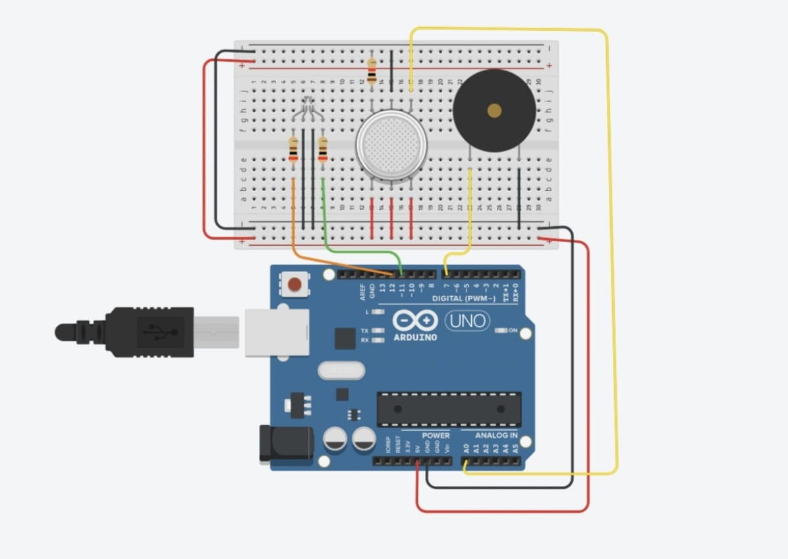

## Gas Leakage Detection:
### Problem Statement:
To design a circuit using Arduino which alerts us if gas concentration is greater than the threshold value.

### Components Used:
1. Arduino Development Board
2. LED RGB
3. Gas Sensor
4. Piezo buzzer
5. Two 220ohm resistance(for LED RGB)
6. One 1kilo-ohm resistance(for gas sensor)

### Schematic:



### Code:
```
int gas = 0;

void setup()
{
  pinMode(A0, INPUT);
  pinMode(12, OUTPUT);
  pinMode(11, OUTPUT);
  pinMode(7, OUTPUT);
}

void loop()
{
  gas = analogRead(A0);         // Reading gas concentration value 
  if (gas >= 200) {             // Threshold value is 200
    digitalWrite(12, HIGH);     // RED color will glow
    digitalWrite(11, LOW);      // GREEN color will not glow
    tone(7, 5274, 500);         // play tone 100 (E8 = 5274 Hz)
  } else {
    digitalWrite(12, LOW);      // RED color will not glow
    digitalWrite(11, HIGH);     // GREEN color will glow
    noTone(7);                  // no tone
  }
  delay(250);                   // Wait for 250 millisecond(s)

  gas;
}
```
### Tinkercad Link:
[Link](https://www.tinkercad.com/things/eDPl7cqVJuX)
