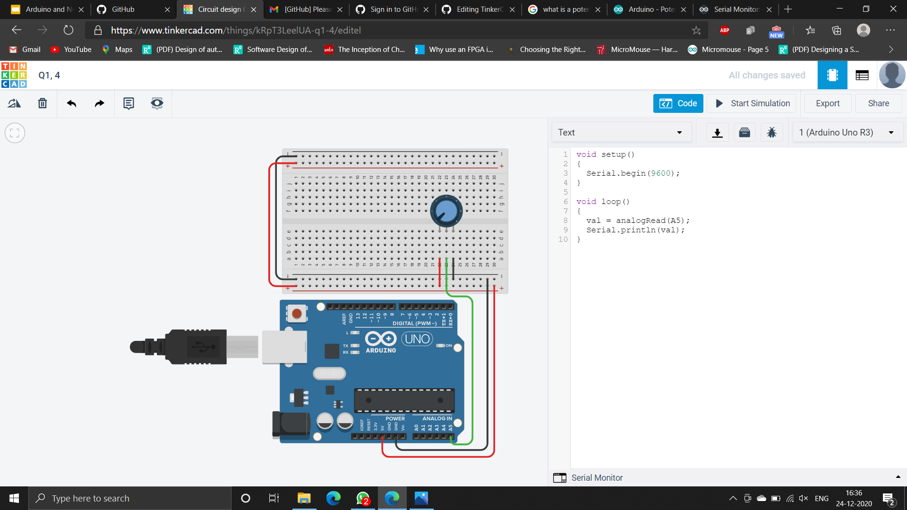

# Problem Statement

## Problem Statement 4
Attach a potentiometer and get input values from it.
## Concept
* The potentiometer is connected to pin (A5) of the Arduino.
* The potentiometer outputs an analog or continuous value so we cannot use a digital pin. Pin A5 is an analog pin, which we have used here.
* The analog values are read into the variable val using the analogRead() function.
* We need to display the value using the Serial Monitor. The Serial Monitor is initialised using Serial.begin(9600) and it is printed using Serial.println(val).
## Screenshot of Circuit and Code

